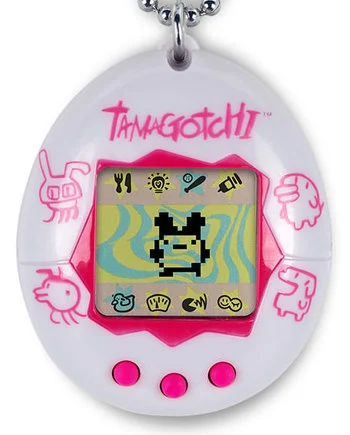
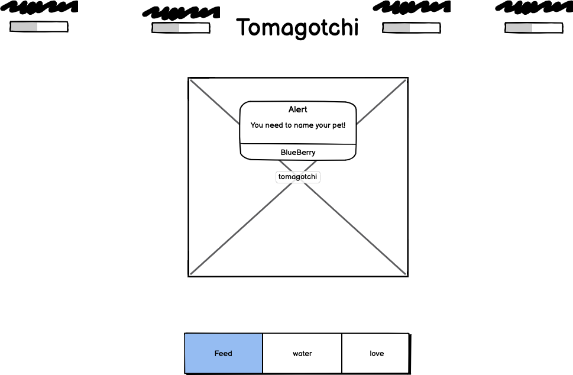

# ProtectZero
## User stories
1. create four progress bars with descripts in the nav
    1. Health, Hunger, Thirst, emotion
        1. health shall decay based on time
        2. hunger shall decay feeding should decay thirst
        3. thirst shall decay and drinking decay emotion
            1. Hunger Thirst and emotion shell give a point to health at 100 win condition will be met and animation will destory world
2. create a prompt alert to be able to gather name of animation
    1. display name of animation in header center replacing the tomagtchi name
3. 
## project goal to mimic

## wireframes

